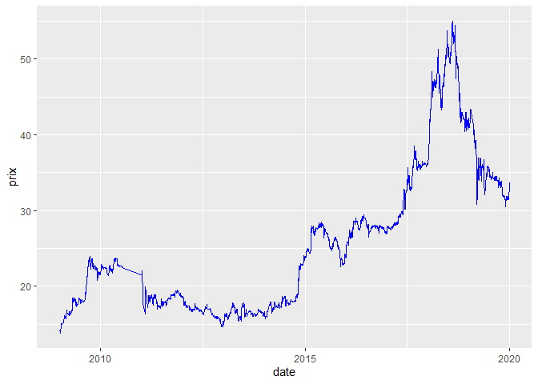
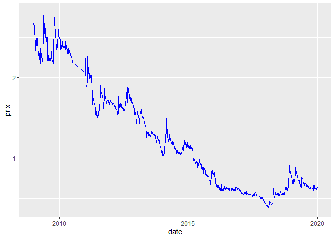

<!-- README.md is generated from README.Rmd. Please edit that file -->

# tunisianfirms

<!-- badges: start -->

<!-- badges: end -->

The goal of tunisianfirms is to diffuses cotation of Tunisian stock
Exchange Firms

## Installation

You can install the released version of tunisianfirms from
[CRAN](https://CRAN.R-project.org) with:

``` r
install.packages("tunisianfirms")
```

## Example

This is a basic example which shows you how to solve a common problem:

``` r
library(tunisianfirms)
## basic example code
cotation("ATTIJARIBANK")
```



``` r
head(sample_data)
#>         date          lib prix
#> 1 2019-01-02 GIFDA5/42931 0.01
#> 2 2019-01-02 SOMCDA3/3725 0.01
#> 3 2019-01-02  TLSDS3/2021 0.01
#> 4 2019-01-03 GIFDA4/23727 0.01
#> 5 2019-01-03 GIFDA5/42931 0.01
#> 6 2019-01-03  SAHDA1/1425 0.01
```


